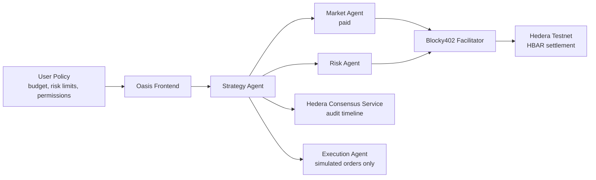

# Oasis Agent Trading

> **Turn an AI trading assistant into a budget-bounded, pay-per-request service** — a free Strategy Agent coordinates paid Market/Risk Agents inside a user-defined budget boundary, settled on Hedera with x402 and audited on-chain.

Oasis Agent Trading solves the problem of **uncontrolled AI agent spending**: it lets an autonomous agent buy the specialist reasoning it actually needs, per request and inside a hard budget ceiling — no API keys, no subscriptions, no runaway bills.

<!-- Badges: build/coverage badges can be wired to CI once a GitHub Actions workflow is added. -->
[](LICENSE)
[](#)
[](#)
[](#)
[](https://hedera.com)
[](#)

## Concept

For anyone who wants AI trading analysis without giving an agent an open checkbook: a user sets a **budget boundary** (per-analysis budget, per-call limit, and which paid Agents are enabled). The **Strategy Agent** is free — it parses a natural-language goal, drafts a strategy, and only buys specialist Market/Risk reasoning when the evidence gap justifies it. Each paid call is quoted, checked against the policy, settled pay-per-request through **x402/Hedera**, and recorded on **Hedera Consensus Service** for audit.



| Agent | Role | Paid? | Responsibility |
| --- | --- | --- | --- |
| Strategy Agent | Free strategy generation | Free | Parses goals, drafts strategies, decides whether paid evidence is needed |
| Market Agent | Market data & signal layer | Usage-based HBAR / call | Provides market confirmation when evidence is missing |
| Risk Agent | Risk engine & challenge layer | Usage-based HBAR / call | Provides adversarial downside review and stress tests |
| Execution Agent | Simulation executor | Free | Generates simulation-only results after final policy/risk checks |
| User Policy | Billing & risk boundary | Free setting | Defines budget, per-call limit, enabled paid Agents, and risk constraints |

## Hackathon

Built for **[ETHOnline 2026](https://ethglobal.com/events/ethonline2026/prizes#hedera)**, on the **Hedera — AI & Agentic Payments** track. Hedera is backing this year's event with **$15,000 in bounties**, with a dedicated focus on **x402 agentic payments**: enabling AI agents to pay for APIs, tools, and services per request in HBAR/USDC — without API keys or subscriptions. This project demonstrates the full loop — an AI agent that autonomously purchases specialist reasoning inside a user-defined budget boundary, settles through the x402/Hedera rail, and writes an on-chain audit trail via Hedera Consensus Service.

## Features

| Feature | Description |
| --- | --- |
| **Policy-authorized billing** | Every paid Agent call is quoted, then checked against budget boundary, per-call limit, and enabled-Agent list before charging |
| **Free Strategy Agent** | Parses natural-language goals, drafts strategies, and decides whether paid evidence is worth buying |
| **Usage-based pricing** | Market Agent prices by candle/indicator/timeframe; Risk Agent by stress scenarios/checks/factors |
| **x402 + Hedera settlement** | Pay-per-request HBAR settlement through Blocky402 on Hedera testnet |
| **On-chain audit** | Decision hashes and payment metadata written to Hedera Consensus Service |
| **Multi-LLM reasoning** | OpenAI, DeepSeek, Claude, and GLM adapters, with a deterministic rule fallback |
| **Simulation-only execution** | Execution Agent generates simulated fills; it never places real trades |
| **Bilingual workspace** | Seven-step UI with EN/中文, live timeline, committee transcript, and budget meter |

## Tech Stack

| Layer | Technology |
| --- | --- |
| Runtime | Node.js ≥ 20 (ESM, no bundler) |
| Chain | Hedera Testnet (HBAR), Hedera Consensus Service |
| Payments | x402 v2 (`@x402/hedera`), Blocky402 facilitator |
| Agent runtime | Custom strategy state machine (`apps/agent`) |
| LLM | OpenAI / DeepSeek / Claude / GLM adapters |
| Market data | Binance + CoinGecko public APIs |
| Frontend | Vanilla HTML / CSS / JS |
| Tests | `node:test` |

## Quick Start

```bash
git clone https://github.com/hwish39-byte/Oasis-Agent-Trading.git
cd Oasis-Agent-Trading
pnpm install

# Offline demo: mock settlement, deterministic reasoner, fixture market data (no keys required)
HEDERA_PAYMENT_MODE=mock OASIS_MARKET_DATA_MODE=fixture OASIS_LLM_MODE=rule pnpm demo:web
```

Open the printed localhost URL and click through the workspace — the full decision loop runs end-to-end with zero configuration.

## Installation & Usage

**Prerequisites:** Node.js ≥ 20 and [pnpm](https://pnpm.io).

| Command | What it does |
| --- | --- |
| `pnpm test` | Run the full test suite (offline, mock mode) |
| `pnpm demo` | Run one decision loop in the CLI |
| `pnpm demo:web` | Start the web workspace + demo API |
| `pnpm demo:service` | Start the x402-gated Market Signal API alone |
| `pnpm demo:risk-service` | Start the x402-gated Risk Challenge API alone |
| `pnpm demo:check-real` | Verify real Hedera/Blocky402/HCS configuration |
| `pnpm demo:real-payment` | Run one real testnet HBAR x402 payment |
| `pnpm demo:create-hcs-topic` | Create the HCS audit topic |

**Configuration** — copy `.env.example` to `.env`:

| Variable | Purpose |
| --- | --- |
| `HEDERA_PAYMENT_MODE` | `real` (default) or `mock` for local tests |
| `HEDERA_NETWORK` | `testnet` for the MVP |
| `HEDERA_USER_PAYER_ACCOUNT_ID` / `HEDERA_OASIS_SPENDER_*` / `HEDERA_OASIS_MERCHANT_ACCOUNT_ID` | Funded Hedera accounts for the payment rail |
| `BLOCKY402_FACILITATOR_URL` | Blocky402 facilitator endpoint |
| `HCS_TOPIC_ID` / `HEDERA_MIRROR_NODE_URL` | HCS audit topic and Mirror Node |
| `OPENAI_API_KEY` / `DEEPSEEK_API_KEY` / `ANTHROPIC_API_KEY` / `GLM_API_KEY` | LLM provider keys (frontend selectable) |
| `STRATEGY_AGENT_PROVIDER` / `STRATEGY_AGENT_MODEL` | Default LLM provider and model |
| `OASIS_LLM_MODE` | `required` (fail without a key) or `rule` (deterministic fallback) |
| `OASIS_MARKET_DATA_MODE` | `live` (Binance/CoinGecko) or `fixture` (local snapshot) |

For the real x402/Hedera settlement flow, see [docs/payment-flow.md](docs/payment-flow.md). For the runtime architecture and implementation map, see [docs/architecture.md](docs/architecture.md).

Never commit private keys, seed phrases, API keys, or funded account credentials.

## License

[MIT](LICENSE) © Oasis Agent Trading contributors.

