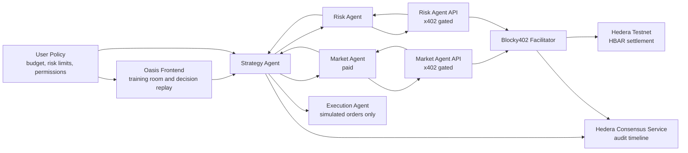

# Oasis Agent Trading

Oasis Agent Trading is a Web3 hackathon project that turns an AI trading assistant into a budget-bounded paid Agent service platform. Strategy Agent is free: it parses a user's trading goal, drafts a strategy, and decides whether more specialist reasoning is needed. Market Agent and Risk Agent quote based on reasoning workload. If a quote fits the user's budget boundary, the backend automatically charges it through the x402/Hedera settlement rail and returns the specialist analysis.

The project is designed for the Hedera AI & Agentic Payments track. Its core proof is policy-authorized Agent billing: a user sets a budget boundary, Strategy Agent recommends paid Market/Risk analysis only when needed, the platform settles approved quotes through the payment adapter, and the runtime records the evidence, charge, and simulated execution result for audit.

## One-line Summary

Oasis Agent Trading lets users buy budget-constrained, auditable AI trading analysis where Strategy Agent coordinates paid Market/Risk Agents inside a Hedera-backed budget boundary.

## Why Hedera

Hedera is suitable for this MVP because it combines EVM compatibility with low, predictable fees and fast finality. For a hackathon demo, the most valuable primitive is not simply deploying on another chain, but enabling high-frequency, low-value, pay-per-request services for autonomous agents.

Key Hedera components:

| Component | Usage in Oasis Agent Trading | MVP Priority |
| --- | --- | --- |
| x402 + Blocky402 | Pay-per-request billing for paid Oasis Agents | Required |
| HBAR | Testnet payment asset to avoid USDC association complexity | Required |
| Hedera Consensus Service | Tamper-resistant timeline for payments, policy versions, and decisions | Recommended |
| Hedera Agent Kit | Wrapper for agent-side Hedera actions | Recommended |
| HTS / USDC | More production-like stablecoin payments | Later |
| Scheduled Transactions | Recurring subscriptions or streaming payments | Later |

## Product Concept

The user configures a policy settings page, such as:

- Target asset: ETH
- Per-analysis paid Agent budget: 0.20 HBAR
- Maximum paid Agent call: 0.05 HBAR
- Enabled paid Agents: Market Agent and Risk Agent
- Budget boundary for automatic paid Agent charges
- Risk rule: do not increase exposure unless risk checks pass
- Execution mode: simulation only

The Agent Committee then decides whether the free Strategy Agent needs paid platform Agents before making a final recommendation.

Example demo flow:

1. Strategy Agent detects a possible ETH breakout and proposes a long candidate.
2. Strategy Agent finds insufficient evidence and decides whether Risk Agent and/or Market Agent are needed.
3. Each specialist Agent quotes from estimated usage, such as market data volume or risk challenge workload.
4. User Policy approves quotes only when they fit the budget boundary, per-Agent limit, and enabled-Agent list.
5. The paid Risk Agent reports that breakout quality is insufficient.
6. The committee rejects the trade.
7. Execution Agent records a simulation-only blocked execution result.
8. The UI shows User Policy, Agent quotes, charged specialist results, final decision, simulated execution output, and HCS audit records.

## Agent Committee

| Agent | Role | Paid? | Responsibility |
| --- | --- | --- | --- |
| Strategy Agent | Free strategy generation | Free | Generates trade candidates and decides whether paid Agent evidence is needed |
| Market Agent | Market data and signal layer | Usage-based HBAR / call | Provides market confirmation when Strategy Agent finds a market evidence gap |
| Risk Agent | Risk engine and challenge layer | Usage-based HBAR / call | Provides adversarial downside review and stress tests |
| Execution Agent | Simulation executor | Free | Generates simulation-only execution results after final policy/risk checks |
| User Policy | Billing and risk boundary | Free setting | Defines per-analysis budget, per-Agent call limit, enabled paid Agents, and risk constraints |

## Architecture



## Policy-Authorized Payment Flow

1. The user sets a budget boundary from the User Policy settings page.
2. Strategy Agent runs for free, analyzes the trading goal, and decides whether Market/Risk Agent reasoning is needed.
3. Each needed paid Agent quote includes a reasoning tier, price, service, and reason.
4. The backend checks the quote against User Policy, remaining budget, per-call limit, Agent-level budget, and enabled paid Agents.
5. If allowed, the backend creates a policy-authorized x402/Hedera payment payload and records an Agent charge.
6. The paid Agent service settles through the payment adapter and returns its analysis result.
7. Strategy Agent composes the final trade / hold / no-trade decision.
8. Execution Agent generates a simulation-only execution report.
9. Payment transaction, request hash, policy version, strategy version, execution simulation, conclusion, and rationale are written to the audit timeline.

## MVP Scope

The MVP should prove a complete paid decision loop:

- Use HBAR on testnet as the payment asset.
- Add a User Policy settings page for per-analysis budget, per-call limit, enabled paid Agents, and automatic charging inside the boundary.
- Keep Market Agent and Risk Agent as internal x402-gated paid capabilities.
- Let Strategy Agent choose whether to recommend paid Agents within User Policy.
- Record payment transaction IDs and decision summaries.
- Use fixed market snapshots for a stable demo.
- Simulate execution results only; do not place real trades.

## Out of Scope for MVP

- Real-money trading
- Mainnet deployment
- Production-grade portfolio management
- USDC / HTS token association flow
- Scheduled or streaming subscriptions
- Fully autonomous execution without explicit user policy

## Hackathon Demo Goals

The demo should show:

- A real x402-gated service deployed on Hedera testnet or mainnet.
- At least one real end-to-end paid request through Blocky402.
- Agent-side policy checks before charging a quoted specialist Agent.
- Billing transitions, such as quoted, budget checked, authorized, settled, and delivered.
- A final simulated trading decision affected by purchased data or risk analysis.
- Public repository documentation with setup, architecture, and payment flow.
- A video demo under five minutes.

## Suggested Repository Structure

```text
.
├── README.md
├── AGENTS.md
├── apps/
│   ├── frontend/              # Oasis UI
│   ├── agent/                 # Strategy, research, risk, and execution agents
│   ├── market-signal-api/     # x402-gated market signal service
│   └── risk-challenge-api/    # x402-gated risk challenge service
├── packages/
│   ├── hedera/                # Hedera account, payment, HCS helpers
│   ├── policy/                # Budget and risk policy engine
│   └── shared/                # Shared types and utilities
├── data/
│   └── snapshots/             # Explicit test fixtures, not the default runtime market source
└── docs/
    ├── architecture.md
    └── payment-flow.md
```

## Development Status

The repository now includes a runnable local MVP:

- Static frontend strategy workspace.
- Demo API for intent parsing, policy drafting, strategy drafting, planning, and runtime execution.
- Strategy Agent runtime with Market Research, Risk, and Execution committee members.
- x402-gated Market Signal API and Risk Challenge API.
- LLM-driven Strategy Agent runtime for real frontend runs when `OPENAI_API_KEY` is configured.
- Live crypto market context from Binance public market data by default.
- Real Hedera testnet HBAR settlement by default, with local mock settlement still available for automated tests.
- Audit hashes, committee transcript, JSONL decision memory, and node:test coverage.

## Setup

Install dependencies, then run:

```bash
pnpm test
pnpm demo:web
```

Open the printed localhost URL and click through the workspace.

Expected environment variables may include:

```bash
HEDERA_NETWORK=testnet
HEDERA_USER_PAYER_ACCOUNT_ID=
HEDERA_OASIS_SPENDER_ACCOUNT_ID=
HEDERA_OASIS_SPENDER_PRIVATE_KEY=
HEDERA_OASIS_MERCHANT_ACCOUNT_ID=
BLOCKY402_FACILITATOR_URL=
HCS_TOPIC_ID=
OPENAI_API_KEY=
DEEPSEEK_API_KEY=
ANTHROPIC_API_KEY=
GLM_API_KEY=
STRATEGY_AGENT_PROVIDER=openai
STRATEGY_AGENT_MODEL=gpt-5
OASIS_LLM_MODE=required
OASIS_MARKET_DATA_MODE=live
```

The frontend User Policy page sets a local budget boundary for the current strategy analysis. `HEDERA_USER_PAYER_ACCOUNT_ID` remains the demo / adapter payer account used by backend payment payloads.

Supported strategy model providers are:

| Provider | Env key | Default model | API style |
| --- | --- | --- | --- |
| `openai` | `OPENAI_API_KEY` | `gpt-5` | OpenAI Responses API |
| `deepseek` | `DEEPSEEK_API_KEY` | `deepseek-chat` | OpenAI-compatible chat completions |
| `claude` | `ANTHROPIC_API_KEY` | `claude-sonnet-4-5` | Anthropic Messages API |
| `glm` | `GLM_API_KEY` | `glm-4.5` | OpenAI-compatible chat completions |

The frontend lets the user choose provider and model for each run. API keys stay on the server in `.env`; they are never sent from the browser.

`OASIS_LLM_MODE=required` makes frontend strategy runs fail clearly when the selected provider API key is missing instead of silently falling back to the deterministic test reasoner. Tests set `OASIS_LLM_MODE=rule` and `OASIS_MARKET_DATA_MODE=fixture` explicitly.

Do not commit real private keys, seed phrases, API keys, or funded account credentials.

## License

TBD.
