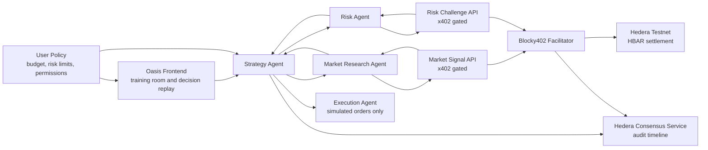

# Oasis Agent Trading

Oasis Agent Trading is a Web3 hackathon project that turns an AI trading assistant into an economically aware Agent Committee. Instead of asking several models to vote, the system gives different agents distinct duties, budgets, and payment permissions. Agents can buy market data, risk challenges, or reasoning services only when needed and only within the user's approved budget.

The project is designed for the Hedera AI & Agentic Payments track. Its core proof is not wallet connection, but an end-to-end paid service flow: an AI agent receives an HTTP 402 payment requirement, signs a payment intent, settles through Blocky402 on Hedera testnet, receives the gated result, and records the decision evidence for audit.

## One-line Summary

Oasis Agent Trading lets AI agents make budget-constrained, auditable trading decisions by paying for external data and risk services through Hedera x402.

## Why Hedera

Hedera is suitable for this MVP because it combines EVM compatibility with low, predictable fees and fast finality. For a hackathon demo, the most valuable primitive is not simply deploying on another chain, but enabling high-frequency, low-value, pay-per-request services for autonomous agents.

Key Hedera components:

| Component | Usage in Oasis Agent Trading | MVP Priority |
| --- | --- | --- |
| x402 + Blocky402 | Pay-per-request access to data and risk APIs | Required |
| HBAR | Testnet payment asset to avoid USDC association complexity | Required |
| Hedera Consensus Service | Tamper-resistant timeline for payments, policy versions, and decisions | Recommended |
| Hedera Agent Kit | Wrapper for agent-side Hedera actions | Recommended |
| HTS / USDC | More production-like stablecoin payments | Later |
| Scheduled Transactions | Recurring subscriptions or streaming payments | Later |

## Product Concept

The user approves a trading policy, such as:

- Target asset: ETH
- Daily research budget: 0.20 HBAR
- Maximum payment per service call: 0.05 HBAR
- Risk rule: do not increase exposure unless the risk challenge passes
- Execution mode: simulation only

The Agent Committee then decides whether it needs paid external services before making a trading recommendation.

Example demo flow:

1. Strategy Agent detects a possible ETH breakout and proposes a long candidate.
2. Risk Agent challenges the proposal and requests an independent risk review priced at 0.02 HBAR.
3. Market Research Agent requests a market signal priced at 0.03 HBAR.
4. Both paid requests are settled through Hedera testnet and Blocky402.
5. The risk service reports that breakout quality is insufficient.
6. The committee rejects the trade.
7. The UI shows the two payments, returned service results, final decision, and HCS audit records.

## Agent Committee

| Agent | Role | Can Initiate x402 Payment | Responsibility |
| --- | --- | --- | --- |
| Strategy Agent | Main AI / strategy generation | Yes | Generates trade candidates and decides whether more information is needed |
| Market Research Agent | Market data and on-chain signal layer | Yes | Buys market and chain signals from the Market Signal API |
| Risk Agent | Risk engine and challenge layer | Yes | Buys independent counterarguments or stress tests from the Risk Challenge API |
| Execution Agent | Simulation executor | No | Executes only simulated orders that pass policy and risk checks |
| User Policy | User approval and risk boundary | No | Defines total budget, per-service limits, allowed assets, and risk constraints |

## Architecture



## x402 Payment Flow

1. An Oasis agent requests a gated data or risk service.
2. The service responds with HTTP 402, including price, receiver, network, and asset requirements.
3. The agent checks the user policy and remaining budget.
4. If allowed, the agent signs the payment intent with its Hedera payer account.
5. The service submits the payment to the Blocky402 facilitator for verification and settlement.
6. After settlement, the service returns the purchased data or risk result.
7. The agent generates a trade / no-trade decision.
8. Payment transaction, request hash, policy version, strategy version, conclusion, and rationale are written to the audit timeline.

## MVP Scope

The MVP should prove a complete paid decision loop:

- Create Hedera testnet accounts for the agent payer and service receiver.
- Use HBAR on testnet as the payment asset.
- Run or fork the Hedera x402 inference pay-per-request proof of concept.
- Replace the inference endpoint with a Market Signal API.
- Add a Risk Challenge API.
- Let the agent choose whether to call each service within budget.
- Record payment transaction IDs and decision summaries.
- Use fixed market snapshots for a stable demo.
- Simulate execution only; do not place real trades.

## Out of Scope for MVP

- Real-money trading
- Mainnet deployment
- Production-grade portfolio management
- USDC / HTS token association flow
- Scheduled or streaming subscriptions
- Fully autonomous execution without explicit user policy

## Hackathon Demo Goals

The demo should show:

- A real x402-gated service deployed on Hedera testnet or mainnet.
- At least one real end-to-end paid request through Blocky402.
- Agent-side policy checks before payment.
- Payment status transitions, such as required, signing, submitted, settled, and delivered.
- A final simulated trading decision affected by purchased data or risk analysis.
- Public repository documentation with setup, architecture, and payment flow.
- A video demo under five minutes.

## Suggested Repository Structure

```text
.
├── README.md
├── AGENTS.md
├── apps/
│   ├── frontend/              # Oasis UI
│   ├── agent/                 # Strategy, research, risk, and execution agents
│   ├── market-signal-api/     # x402-gated market signal service
│   └── risk-challenge-api/    # x402-gated risk challenge service
├── packages/
│   ├── hedera/                # Hedera account, payment, HCS helpers
│   ├── policy/                # Budget and risk policy engine
│   └── shared/                # Shared types and utilities
├── data/
│   └── snapshots/             # Explicit test fixtures, not the default runtime market source
└── docs/
    ├── architecture.md
    └── payment-flow.md
```

## Development Status

The repository now includes a runnable local MVP:

- Static frontend strategy workspace.
- Demo API for intent parsing, policy drafting, strategy drafting, planning, and runtime execution.
- Strategy Agent runtime with Market Research, Risk, and Execution committee members.
- x402-gated Market Signal API and Risk Challenge API.
- LLM-driven Strategy Agent runtime for real frontend runs when `OPENAI_API_KEY` is configured.
- Live crypto market context from Binance public market data by default.
- Mock Hedera HBAR settlement by default, with real x402/Blocky402 adapter hooks isolated in `packages/hedera`.
- Audit hashes, committee transcript, JSONL decision memory, and node:test coverage.

## Setup

Install dependencies, then run:

```bash
pnpm test
pnpm demo:web
```

Open the printed localhost URL and click through the workspace.

Expected environment variables may include:

```bash
HEDERA_NETWORK=testnet
HEDERA_AGENT_ACCOUNT_ID=
HEDERA_AGENT_PRIVATE_KEY=
HEDERA_SERVICE_ACCOUNT_ID=
HEDERA_SERVICE_PRIVATE_KEY=
BLOCKY402_FACILITATOR_URL=
HCS_TOPIC_ID=
OPENAI_API_KEY=
DEEPSEEK_API_KEY=
ANTHROPIC_API_KEY=
GLM_API_KEY=
STRATEGY_AGENT_PROVIDER=openai
STRATEGY_AGENT_MODEL=gpt-5
OASIS_LLM_MODE=required
OASIS_MARKET_DATA_MODE=live
```

Supported strategy model providers are:

| Provider | Env key | Default model | API style |
| --- | --- | --- | --- |
| `openai` | `OPENAI_API_KEY` | `gpt-5` | OpenAI Responses API |
| `deepseek` | `DEEPSEEK_API_KEY` | `deepseek-chat` | OpenAI-compatible chat completions |
| `claude` | `ANTHROPIC_API_KEY` | `claude-sonnet-4-5` | Anthropic Messages API |
| `glm` | `GLM_API_KEY` | `glm-4.5` | OpenAI-compatible chat completions |

The frontend lets the user choose provider and model for each run. API keys stay on the server in `.env`; they are never sent from the browser.

`OASIS_LLM_MODE=required` makes frontend strategy runs fail clearly when the selected provider API key is missing instead of silently falling back to the deterministic test reasoner. Tests set `OASIS_LLM_MODE=rule` and `OASIS_MARKET_DATA_MODE=fixture` explicitly.

Do not commit real private keys, seed phrases, API keys, or funded account credentials.

## License

TBD.
